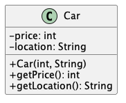
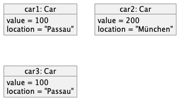
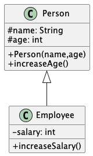
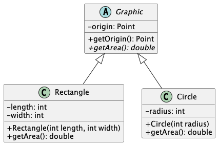
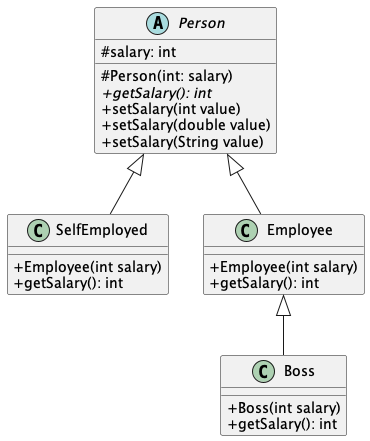
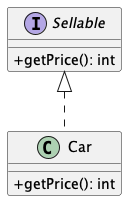
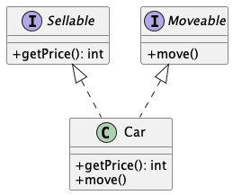

# Einführung: Recap Objektorientierte Programmierung in Java

Im Laufe der Vorlesung beschäftigen wir uns mit einer Vielzahl von Problemen rund um die Softwareentwicklung. Das Programmieren ist hierbei nur ein kleiner Teil, und das Ziel der Vorlesung ist nicht euch Programmieren beizubringen -- das solltet ihr bereits aus Programmieren 1 (und eventuell auch Programmieren 2) kennen. Allerdings benötigen wir ein Grundverständnis von Programmierkonzepten und der Objektorientierung, um sinnvoll über andere Aspekte wie beispielsweise Design zu sprechen. Wir beginnen daher mit einer kurzen Wiederholung wichtiger Konzepte der Objektorientierung. Dieses Jupyter Notebook soll dabei nur als Erinnerung dienen und ist keine vollständige Abhandlung von Objektorientierter Programmierung (dazu gibt es ganze Bücher).

Hinweis: Dieses Jupyter-Notebook soll nicht als vollständiges Scriptum zur Vorlesung dienen. Der Hauptzweck ist, die Code/Diagramm-Beispiele, die ich im Laufe der Vorlesung erstelle, zu sammeln und zugänglich zu machen.

Die Quellen zu den Jupyter Notebooks zur Vorlesung werden über das Semester hinweg hier gesammelt: [https://github.com/se2p/se2022](https://github.com/se2p/se2022) (Wie man Git benutzt behandeln wir in Woche 2).

## UML Klassendiagramme

UML ist die _Unified Modeling Language_, und bezeichnet eine Reihe von Diagrammen mit denen verschiedene Aspekte von Softwaresystemen beschrieben werden können. Wir werden im Laufe der Vorlesung verschiedene Diagrammarten kennenlernen, wir benötigen für diese Einheit einen ersten Teil der wichtigsten Diagrammart: *Klassendiagramme*.

Als Beispiel verwenden wir eine Klasse für ein Auto (`Car`), als Teil eines Online-Verkaufssystems. Dazu braucht ein `Car` Attribute wie `price` oder `location`, die den Zustand eines Objektes definieren. Zur Interaktion soll die Klasse eine Schnittstelle durch Methoden `getPrice` und `getLocation` bieten. Diese Klasse wird durch das folgende Klassendiagramm beschrieben:



Wir verwenden [PlantUML](https://plantuml.com/) um UML Diagramme zu erzeugen. Wir werden PlantUML noch genauer vorstellen wenn wir im Laufe der Vorlesung dann eigene UML Diagramme erstellen.

Die gleiche Klasse in Java implementiert sieht so aus:


```Java
class Car {
    private int price;
    
    private String location;
    
    public Car(int price, String location) {
        this.price = price;
        this.location = location;
    }
    
    public int getPrice() {
        return price;
    }
    
    public String getLocation() {
        return location;
    }
}
```


```Java
Car car = new Car(1000, "Passau")
```


```Java
car.getPrice()
```


    1000


```Java
car.getLocation()
```


    Passau


## Objektidentität und Objektgleichheit

Ein Objekt ist systemweit eindeutig identifizierbar, es kann den Zustand ändern aber behält die gleiche Identität. Um den Unterschied zu demonstrieren, erweitern wir die `Car` Klasse um eine `equals` Methode, die den Objektzustand zweier `Car` Instanzen vergleicht. Wir fügen auch noch eine `toString` Methode hinzu, damit wir die Objektzustände einfacher ausgeben lassen können.


```Java
class Car {
    private int price;
    private String location;
    
    public Car(int price, String location) {
        this.price = price;
        this.location = location;
    }
    
    public int getPrice() {
        return price;
    }
    
    public String getLocation() {
        return location;
    }
    
    public boolean equals(Object other) {
        if (other.getClass() != Car.class) {
            return false;
        }
        Car otherCar = (Car) other;
        return price == otherCar.price && location.equals(otherCar.location);
    }
    
    public String toString() {
        return "Car value = " + price +", location = " + location;
    }
}
```

Wir legen zwei Instanzen an:


```Java
Car car1 = new Car(100, "Passau");
```


```Java
Car car2 = new Car(200, "München");
```


```Java
car1
```


    Car value = 100, location = Passau


```Java
car2
```


    Car value = 200, location = München


Objektidentität wird mithilfe des `==` Operators ermittelt:


```Java
car1 == car2
```


    false


```Java
car1 == car1
```


    true


Objektgleichheit wird mithilfe der `equals` Methode ermittelt:


```Java
car1.equals(car2)
```


    false


```Java
car1.equals(car1)
```


    true


Legen wir nun noch ein drittes Auto an, mit gleichem Objektzustand wir `car1`.


```Java
Car car3 = new Car(100, "Passau");
```


```Java
car1 == car3
```


    false


```Java
car1.equals(car3)
```


    true


Der Zusammenhang der Objekt kann auch in einem UML _Objektdiagramm_ erkannt werden. Ein UML Objektdiagramm ist sehr ähnlich zu einem Klassendiagramm und verwendet die gleiche Notation, aber es zeigt konkrete Objekte und deren Attributwerte. Objektdiagramme werden hauptsächlich verwendet um Beispiele zu Klassendiagrammen zum besseren Verständnis zu zeigen.



(Die UML Diagramme in dieser Vorlesung sind allgemein wenig komplex da wir Assoziationen zwischen Klassen noch nicht betrachten; dies kommt in einer späteren Vorlesung).

Beachte dass `car1` in Java nicht das Objekt selbst ist, sondern eine Referenz auf das Objekt. Wir können weitere Referenzen auf das selbe Objekt anlegen.


```Java
Car car4 = car1;
```

Die Objektreferenz `car4` referenziert das identische Objekt wie `car1`:


```Java
car4 == car1
```


    true


```Java
car4 == car3
```


    false


```Java
car4.equals(car1)
```


    true


```Java
car4.equals(car3)
```


    true


## Vererbung

Vererbung ist ein Mechanismus um neue Klassen mit Hilfe bereits bestehender Klassen zu definieren. Gegeben die folgende Klasse `Person`.


```Java
class Person {
  protected String name;
  protected int age;
  
  public Person(String name, int age) {
    this.name = name;
    this.age = age;
  }

  public void increaseAge() {
    age++;
  }
  
  public String toString() {
    return "Person " + name + ": " + age;
  }
}
```

Legen wir zunächst ein Beispielobjekt an.


```Java
Person p = new Person("Bob", 21)
```


```Java
p
```


    Person Bob: 21


```Java
p.increaseAge()
```


```Java
p
```


    Person Bob: 22


Wir definieren nun eine Unterklasse `Employee`, diese erbt die Attribute und Methoden der Superklasse `Person`, aber kann neue Attribute und Methoden definieren. Im UML-Klassendiagramm wird die Vererbungsbeziehung wie folgt dargestellt:



In Java implementiert sieht die Unterklasse `Employee` so aus:


```Java
class Employee extends Person {
  private int salary;
  
  public Employee(String name, int age, int salary) {
    super(name, age);
    this.salary = salary;
  }
  
  public void increaseSalary() {
    salary += 1000;
  }
  
  public String toString() {
    return "Employee " + name + ": " + age +" earns " + salary;
  }
}
```


```Java
Employee e = new Employee("John", 33, 5000)
```


```Java
e
```


    Employee John: 33 earns 5000


Objekte vom Typ `Employee` haben Zugriff auf die in der Klasse definierten Methoden:


```Java
e.increaseSalary()
```


```Java
e
```


    Employee John: 33 earns 6000


Objekte vom Typ `Employee` haben ebenso Zugriff auf die von der Superklasse geerbten Methoden:


```Java
e.increaseAge()
```


```Java
e
```


    Employee John: 34 earns 6000


## Abstrakte Klassen

Das `Employee` Beispiel zeigte, wie Vererbung verwendet wird zur _Spezialisierung_: Eine spezialisierte Unterklasse muss nur Additionen und Änderungen deklarieren. Ebenso kann man Vererbung verwenden zur _Verallgemeinerung_. Die Verallgemeinerung muss hierbei nicht notwendigerweise instantiierbar sein. Eine Klasse von der keine Objekte angelegt werden können, sondern die nur verallgemeinerte Eigenschaften und Schnittstellen beschreiben, sind _abstrakt_.

Als Beispiel betrachten wir Klassen für graphische Formen, als Teil eines hypothetischen Systems mit dem wir diese am Computer darstellen können. Alle Formen teilen gewisse Eigenschaften, beispielsweise dass sie innerhalb der Darstellungsfläche einen Ursprung (`origina`) haben. Jede Form soll auch eine Möglichkeit haben die Fläche zu berechnen (`getArea`), allerdings ist diese Berechnung natürlich für unterschiedliche Realisierungen der Formen verschieden. Wir definieren die gemeinsamen Attribute (`origin`) und die gemeinsamen Schnittstellen (`getArea`) in einer abstrakten Klasse `Graphic`. Die Implementierung der abstrakten Methode `getArea` erfolgt dann in den konkreten Unterklassen `Rectangle` und `Circle`.




```Java
import java.awt.Point
```


```Java
abstract class Graphic {
  private Point origin = new Point(0,0);
 
  public Point getOrigin() {
    return origin;
  }
 
  public abstract double getArea();
}
```


```Java
class Rectangle extends Graphic {
  private int length;
  private int width;
  
  public Rectangle(int width, int length) {
    this.length = length;
    this.width = width;
  }
  
  public double getArea() {
    return length * width;
  }
}
```


```Java
class Circle extends Graphic {
  private int radius;
  
  public Circle(int radius) {
    this.radius = radius;
  }
  
  public double getArea() {
    return radius * radius * Math.PI;
  }
}
```

Wir können nun auf Instanzen der Klasse `Rectangle` die Fläche ausrechnen, aber auch die von der Superklasse geerbten Methoden (`getOrigin`) aufrufen.


```Java
Rectangle rectangle = new Rectangle(10, 20)
```


```Java
rectangle.getArea()
```


    200.0


```Java
rectangle.getOrigin()
```


    java.awt.Point[x=0,y=0]


Das gilt ebenso für andere Unterklassen von `Graphic`, wie `Circle`.


```Java
Circle circle = new Circle(100)
```


```Java
circle.getArea()
```


    31415.926535897932


```Java
circle.getOrigin()
```


    java.awt.Point[x=0,y=0]


## Polymorphie

Die in der Klasse `Graphic` abstrakt definierte Methode `getArea` ist _polymorph_: Eine Methode ist polymorph, wenn sie in verschiedenen Klassen einer Vererbungshierarchie implementiert ist; in unserem Fall in `Rectangle` und in `Circle`.

Die klassenabhängige Auswahl einer bestimmten Implementierungsmethode zu einem Operationsaufruf (zu einer empfangenen Nachricht) zur Programmlaufzeit nennt man _dynamisches Binden_. Um zu sehen wie dies funktioniert müssen wir nur Objektreferenzen vom Typ `Graphic` anlegen:


```Java
Graphic g1 = new Rectangle(100, 200);
```


```Java
Graphic g2 = new Circle(10);
```

Je nachdem ob das `Graphic` Objekt ein `Rectangle` oder ein `Circle` ist wird dynamisch die entsprechende Methode aufgerufen.


```Java
g1.getArea()
```


    20000.0


```Java
g2.getArea()
```


    314.1592653589793


Dynamic Binding findet man häufig wenn Methoden definiert werden, die nur die Schnittstelle eine Superklasse benötigen, dabei aber die konkreten Implementierungen der Unterklassen verwenden. Beispielsweise können wir eine Methode definieren, die uns einen Ausgabe-String für beliebige `Graphic` Objekte erzeugt.


```Java
String exampleMethod(Graphic g) {
  return "The area is " + g.getArea();
}
```


```Java
exampleMethod(g1)
```


    The area is 20000.0


```Java
exampleMethod(g2)
```


    The area is 314.1592653589793


## Overloading vs. Overriding

Ein wichtiges Konzept bei der Vererbung und Polymorphie ist die Unterscheidung zwischen _Overloading_ und _Overriding_. Betrachten wir die folgende Vererbungshierarchie: Eine `Person` (abstrakte Klasse) definiert Schnittstellen um das Gehalt (`salary`) abzufragen und zu ändern. Das Gehalt wird unterschiedlich berechnet je nachdem ob die Person selbständig ist (`SelfEmployed`), ein regulärer Angestellter ist (`Employee`), oder ein Angestellter mit Personalverantwortung ist (`Boss`).




```Java
abstract class Person {

  protected int salary = 1000;
  
  protected Person(int salary) {
    this.salary = salary;
  }
  
  public abstract int getSalary();
  
  public void setSalary(int value) {
    System.out.println("Setting salary to int value");
    salary = value;
  }
  
  public void setSalary(double value) {
    System.out.println("Setting salary to double value");
    salary = (int) Math.ceil(value);
  }
  
  public void setSalary(String value) {
    System.out.println("Setting salary to string value");
    salary = Integer.parseInt(value);
  }

}
```


```Java
class SelfEmployed extends Person {

  public SelfEmployed() {
    super(0);
  }

  public int getSalary() {
    return 0;
  }
}
```


```Java
class Employee extends Person {

  public Employee(int salary) {
    super(salary);
  }

  public int getSalary() {
    return salary;
  }
}
```


```Java
class Boss extends Employee {
  public Boss(int salary) {
    super(salary);
  }
  
  public int getSalary() {
    return (int) Math.ceil(salary * 1.2); // Bonus
  }
}
```

Sehen wir uns zunächst die Methode `getSalary` an.


```Java
Person p1 = new SelfEmployed()
```


```Java
Person p2 = new Employee(1000)
```


```Java
Person p3 = new Boss(10000)
```


```Java
p1.getSalary()
```


    0


```Java
p2.getSalary()
```


    1000


```Java
p3.getSalary()
```


    12000


Je nach konkreter Klasse wir bei Aufruf der `getSalary` Methode eine unterschiedliche Implementierung aufgerufen. Diese methode ist in `Person` abstrakt deklariert, und wird dann von `SelfEmployed` und `Employee` implementiert. Klasse `Boss` überschreibt die Methode mit einer anderen Implementierung. Dieses Überschreiben einer Methode ist _Overriding_.

Zum Vergleich sehen wir uns nun an wir das Setzen des Gehalts funktioniert. Dazu definiert die Klasse `Person` drei verschiedene Methoden `setSalary` -- alle drei Methoden haben den identischen Namen und Returnwert, aber unterschiedliche Parameter; die Methode `setSalary` ist also _überladen_.


```Java
p2.setSalary(100)
```

    Setting salary to int value


```Java
p2.getSalary()
```


    100


```Java
p2.setSalary(200.5)
```

    Setting salary to double value


```Java
p2.getSalary()
```


    201


```Java
p2.setSalary("300")
```

    Setting salary to string value


```Java
p2.getSalary()
```


    300


## Interfaces

Neben der klassischen Vererbung abstrakter Klassen bietet Java auch die Möglichkeit, verschiedene Objekttypen mit Hilfe von _Interfaces_ zu definieren. Ein Interface ist eine Schnittstellendefinition, und hat im allgemeinen weder einen Zustand (d.h. Attribute), noch Implementierungen von Methoden. (Seit Java 9 gibt es Default-Implementierungen und finale Variablen in Interfaces). 

Interfaces erlauben unterschiedliche Sichten auf Objekte für verschiedene Anwendungszwecke. Man erkennt dies meist in der Benennung: Interfaces haben oft Namen die Eigenschaften beschreiben und in `-able` enden, während abstrakte Klassen eher mit Substantiven benannt werden.




```Java
interface Sellable {
  int getPrice();
}
```


```Java
class Car implements Sellable {
  public int getPrice() {
    return 100;
  }
}
```


```Java
Car c = new Car()
```


```Java
c.getPrice()
```


    100


Eine Klasse kann immer nur von einer Superklasse erben (`extends`); eine Klasse kann aber mehrere Interfaces implementieren (`implements`). Wir können beispielsweise unsere `Car` Klasse nicht nur `Sellable` machen, sondern auch `Moveable`:




```Java
interface Moveable {
  void move();
}
```


```Java
class Car implements Sellable, Moveable {
  public int getPrice() {
    return 100;
  }
  
  public void move() {
    System.out.println("Brrm brrm");
  }
}
```


```Java
Car c = new Car()
```


```Java
c.move()
```

    Brrm brrm


```Java
c.getPrice()
```


    100


## Weitere Objektorientierte Konzepte

Die Beispiele und Ausführungen in diesem Jupyter Notebook betreffen Konzepte die in weiterer Folge insbesondere für Objektorientertes Design wichtig werden, und basierend hauptsächlich auf Erfahrungen wo es Verständnisprobleme gibt. Wenn es weitere Themen gibt wo Beispiele gebraucht werden, dann bin ich für Anregungen zu Erweiterungen dankbar. Nicht behandelt wurde beispielsweise Kapselung (private/protected/package private/public Sichtbarkeit von Attributen/Methoden), Message Passing, Persistenz, und vieles mehr.
